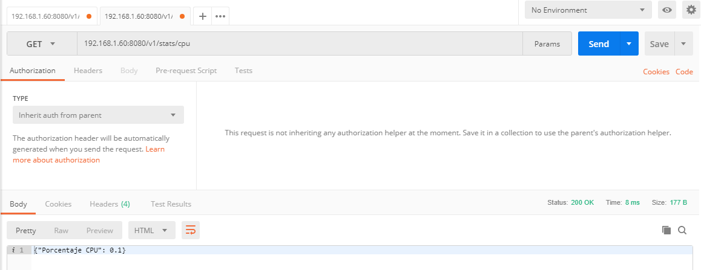
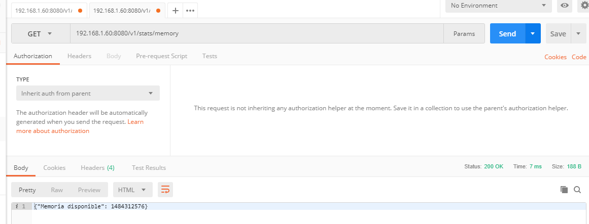
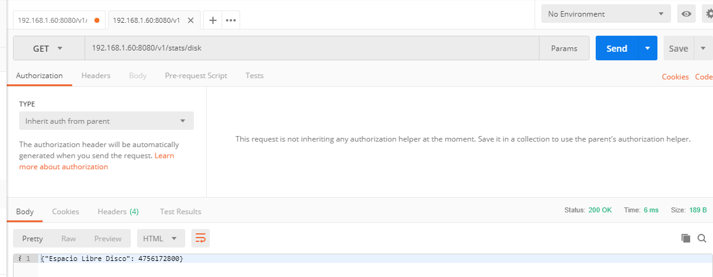
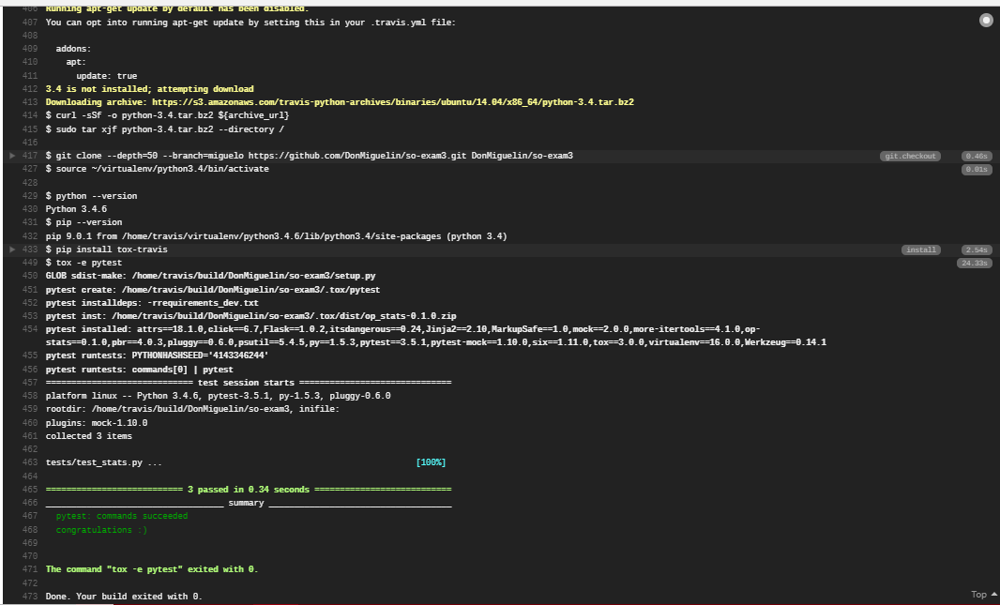

# so-exam3

**Nombre:** Miguel Andrés Isaza Barona  
**Código:** A00054628  
**Materia:** Sistemas operacionales  
**Correo personal:** miguel11andres@hotmail.com  
**URL repositorio:** https://github.com/DonMiguelin/so-exam3  

### 3 Implementar un servicio web en Flask siguiendo la estructura definida en clase.  
- Primero se crea un ambiente virtual (en mi caso se llama flaskdev) y se crean 2 archivos con las dependencias necesarias para ese ambiente virtual (requirements_dev.txt y requirements.txt los cuales se encuentran en el presente repositorio) con el fin de implementar el servicio web Flask.  

- Luego se crea una carpeta llamada op_stats donde se crea un archivo.py (se llama stats.py) el cual contiene una clase y en esa clase están los métodos que dan información sobre el porcentaje de la cpu, memoria disponible y espacio libre del disco del PC:  

```
import psutil

class Stats():

  @classmethod
  def dar_porcentaje_cpu(cls):
    porcentaje = psutil.cpu_percent()
    return porcentaje

  @classmethod
  def dar_memoria_disponible(cls):
    ram_disponible = psutil.virtual_memory().available
    return ram_disponible

  @classmethod
  def dar_espacio_disco(cls):
    espacio_disponible = psutil.disk_usage('/').free
    return espacio_disponible
   ```  
- Luego se crea otro archivo con los métodos necesarios para implementar el servicio web flask (este archivo se llama app.py también se encuentra en el presente repositorio):  

```
from flask import Flask
import json
import sys
sys.path.append('/home/flaskdev/so-exam3')
from op_stats.stats import Stats

app = Flask(__name__)

@app.route('/v1/stats/cpu')
def informacion_cpu():
    info_cpu = Stats.dar_porcentaje_cpu()
    return json.dumps({'Porcentaje CPU': info_cpu})

@app.route('/v1/stats/memory')
def informacion_memoria():
    info_memoria = Stats.dar_memoria_disponible()
    return json.dumps({'Memoria Disponible': info_memoria})

@app.route('/v1/stats/disk')
def informacion_disco():
    info_disco = Stats.dar_espacio_disco()
    return json.dumps({'Espacio Libre Disco': info_disco})


if __name__ == '__main__':
    app.run(host='0.0.0.0',port=8080)
   ```  
- Luego esto se ejecuta con el comando ``python op_stats/app.py`` y mediante el uso de Postman se hacen las respectivas solicitudes HTTP que en este caso es el get:  

  

  

  

- Podemos observar la salida de estas peticiones en la maquina virtual centos7:  

  

### 4 Implemente las pruebas unitarias para los servicios empleando Fixtures y Mocks como se vio en clase.  
- Primero se crea una carpeta llamada test (aquí se pondran las pruebas a realizar), luego de esto creamos un archivo llamado test_stats.py para realizar las pruebas del servicio web:  
```
import pytest
import sys
sys.path.append('/home/flaskdev/so-exam3')

from op_stats.app import app
from op_stats.stats import Stats

@pytest.fixture
def client():
  client = app.test_client()
  return client

def test_get_cpu_percent(mocker, client):
  mocker.patch.object(Stats, 'dar_porcentaje_cpu', return_value=100)
  response = client.get('/v1/stats/cpu')
  assert response.data.decode('utf-8') == '{"Porcentaje CPU": 100}'
  assert response.status_code == 200

def test_get_available_memory(mocker, client):
  mocker.patch.object(Stats, 'dar_memoria_disponible', return_value=2000)
  response = client.get('/v1/stats/memory')
  assert response.data.decode('utf-8') == '{"Memoria Disponible": 2000}'
  assert response.status_code == 200


def test_get_disk_space(mocker, client):
  mocker.patch.object(Stats, 'dar_espacio_disco', return_value=1000)
  response = client.get('/v1/stats/disk')
  assert response.data.decode('utf-8') == '{"Espacio Libre Disco": 1000}'
  assert response.status_code == 200
  ```  
  
- Luego se ejecuta el comando ``pytest -v`` (el cual busca las pruebas que hay disponibles en el directorio, es el equivalente a ``pytest test_stats.py``) para correr las pruebas:  
  

### 5 Emplee un servicio de integracíon continua que haga uso de las pruebas unitarias desarrolladas para validar sus commits.  

- Primero se crea un archivo llamado tox.ini (aquí se pone la información básica del proyecto y los entornos de prueba que deseamos que ejecute nuestro proyecto) se especifican las librerías, el lenguaje a usar, las dependencias y por último el comando a ejecutar que en este caso es pytest:  
```
[tox]
envlist = pytest 

[testenv]
basepython = python3

[testenv:pytest]
deps =
  -rrequirements_dev.txt
commands =
  pytest
  ```  
  
- Para ejecutar este archivo se usa el comando ``tox -e pytest``, aquí mostramos los resultados:  
  

- Para finalizar, se crea un último archivo llamado .travis.yml, que es un archivo de texto en formato YAML que se agrega al directorio raíz del repositorio. En este archivo se especifica el lenguaje de programación utilizado, el entorno de construcción y pruebas deseadas y otros parámetros. Cuando se ha activado Travis CI para un repositorio en GitHub, este notifica cada vez que se hagan nuevos commits o pull request. También se puede configurar para que solo se ejecute para un branch específico. Travis CI revisará la rama y ejecutará los comandos especificados en .travis.yml (como se muestra a continuación):  
```
sudo: false
language: python
notifications:
  email: false
python:
- '3.4'```
```install: pip install tox-travis
script: tox -e pytest
``` 
- Luego de que se ejecute ese archivo, podremos ver los resultados:  
  

  

  

